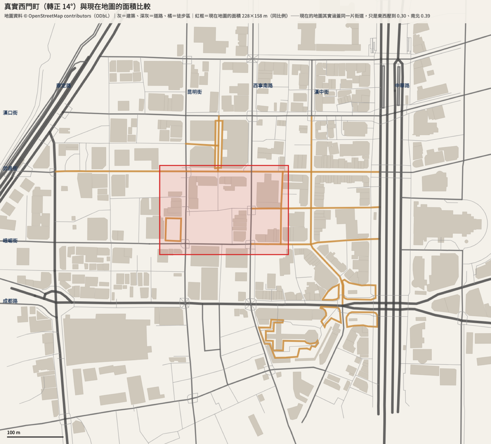
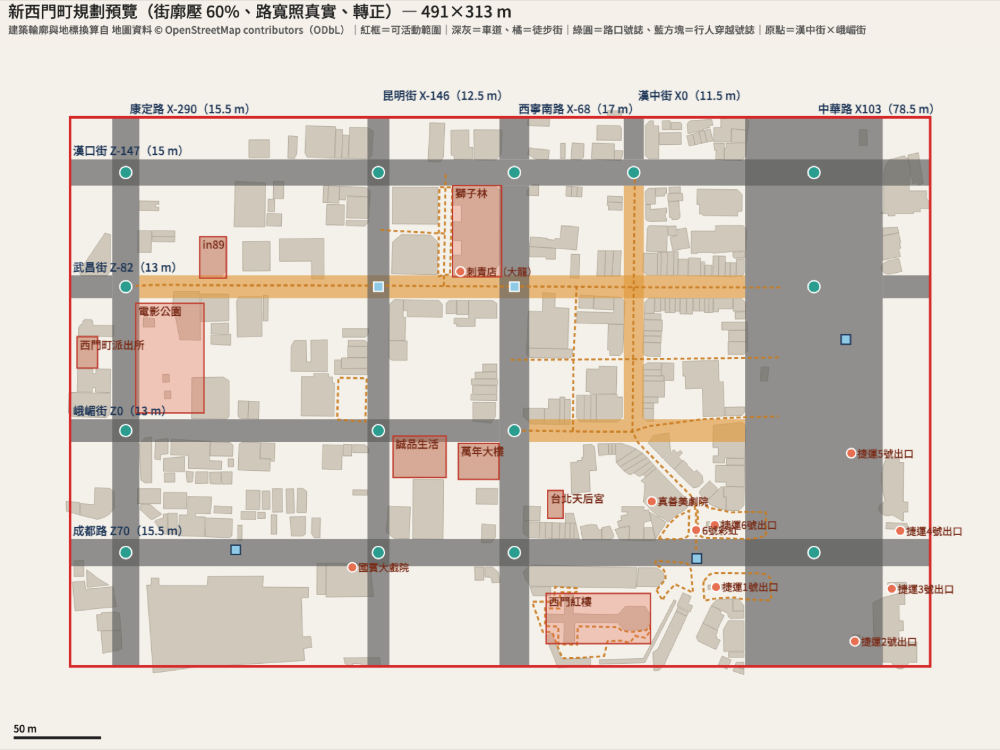

# 西門町地圖重新設計 — 第一段：調研與規劃

## 背景與目標

現在的西門町地圖其實已經包含康定路到中華路、漢口街到成都路的街道，但壓得很扁：東西向只有真實的 0.30 倍、南北向 0.39 倍（康定路 X −100 到中華路 X 80 是 180 m，真實約 600 m），面積約真實核心範圍的 18%；而且少了南北向的昆明街（現在做成東西向，方向錯）。這份設計以真實西門町為藍本重新規劃，做為「台北地圖的第一個街區」與之後所有街區的品質樣板。

整件事拆成四段，這份文件是**第一段（調研與規劃）**的成果：

1. **調研與規劃**（本文件）
2. **地圖改資料驅動**：現有系統改讀地圖資料檔（另寫設計）
3. **照規劃建造**：換成新西門町的資料，分批建造
4. **接台灣玩法**：例如天后宮擲筊

**成功標準（整件事）**：走在新地圖裡認得出是西門町——街道順序、地標位置、徒步區、紅樓與 6 號出口一帶都對；FPS 維持在 60 以上且留有餘裕。

## 決策摘要

| 項目 | 決定 |
|---|---|
| 比例 | 街廓長度壓到 0.6，路寬不壓縮 |
| 路寬 | 照真實：由 OSM 兩側建築立面距離量出（方法見第一節）；路寬帶就是立面到立面 |
| 範圍 | 外圍道路（漢口街、康定路、中華路、成都路）兩側都納入，南到紅樓後方 |
| 方位 | 整張圖轉正 14°，主格子正交；少數斜的地方（6 號出口那段、紅樓前）做成徒步廣場 |
| 原點 | 維持現在的慣例：漢中街中心 × 峨嵋街中心；+X 東、+Z 南 |
| 地標 | 分三級，精修分批，第一批：紅樓、天后宮、6 號出口 |
| 名稱 | 公共／歷史地標用真名；商業品牌改「明顯不同、帶台式幽默」的諧仿名，不用真實 logo |
| 建築 | OSM 輪廓當錨點（裁到立面線），沿街補滿台灣街屋；材質分組共用 |
| 招牌文字 | 離線腳本產生 PNG 圖集，不在遊戲裡即時畫字 |
| 銜接 | 第二段先換管線（快照測試證明純重構不變）再逐一修 bug；散落座標在第三段直接錨定到新地圖的地名 |

## 一、範圍、比例、街道網

- 新地圖可活動範圍：**X −321.5〜169.1、Z −178.9〜134.6，約 491 × 313 m**
- 換算：真實座標轉正 14° 後，路寬帶內比例 1、街廓與外側比例 0.6，原點平移到漢中街 × 峨嵋街
- 已知變形：比例 1 套在整條路寬帶上，包括路段不存在的地方（例如漢中街在峨嵋街以南沒有直路），所以紅樓東西向約 0.65 倍而不是 0.6；可接受

**路寬量測方法**（腳本 `measure_street`）：沿每條路每 4 m 取樣兩側最近的建築立面，搜尋範圍一般路 25 m、中華路 50 m（太大會把公園、空地旁的取樣當成寬路）。寬度取第 25 百分位（OSM 缺漏會讓個別取樣偏寬），中心取最窄一半取樣的立面中點中位數（只有一側抓到近處建築的取樣，中點會被遠處建築帶偏），量兩輪。腳本同時輸出 P10／P25／P50，以下情況會提醒人工確認：P25 與 P10 差距超過 3 m（漢中街：P10 8.5、P25 11.6，兩側有窄巷口），或兩側都抓到建築的有效取樣少於 20 個（康定路 12、昆明街 18、西寧南路 17——寬度與舊值或常識相符，但樣本少，建造時再看一次）。

**路段**（起訖是遊戲座標；停在交叉路的路緣，路口路面歸交叉的車道）

| 路名 | 位置 | 起〜訖 | 路寬 | 類型 | 單行（OSM，依長度加權） |
|---|---|---|---|---|---|
| 康定路 | X −289.7 | Z −178.9〜134.6 | 15.5 | 車道 | 雙向 |
| 昆明街 | X −145.7 | Z −178.9〜134.6 | 12.5 | 車道 | 往北（−Z） |
| 西寧南路 | X −68.1 | Z −178.9〜−154.9（漢口街以北） | 17 | 車道 | 雙向 |
| 西寧南路 | X −68.1 | Z −139.9〜134.6 | 17 | 車道 | 往南（+Z） |
| 漢中街 | X 0 | Z −178.9〜−154.9（漢口街以北） | 11.5 | 車道 | 往南（+Z） |
| 漢中街 | X 0 | Z −139.9〜−6.5（漢口街〜峨嵋街） | 11.5 | 徒步 | — |
| 中華路 | X 102.8 | Z −178.9〜134.6 | 78.5 | 車道＋分隔島 | 雙向 |
| 漢口街 | Z −147.4 | X −321.5〜169.1 | 15 | 車道 | 往東（+X） |
| 武昌街 | Z −82.2 | X −321.5〜−297.5（康定路以西） | 13 | 車道 | 往西（−X） |
| 武昌街 | Z −82.2 | X −282.0〜63.6（康定路〜中華路） | 13 | 徒步 | — |
| 武昌街 | Z −82.2 | X 142.1〜169.1（中華路以東） | 13 | 車道 | 往西（−X） |
| 峨嵋街 | Z 0 | X −321.5〜−76.6（西寧南路以西） | 13 | 車道 | 往東（+X） |
| 峨嵋街 | Z 0 | X −59.6〜63.6（西寧南路〜中華路） | 13 | 徒步 | — |
| 成都路 | Z 69.6 | X −321.5〜35.6 | 15.5 | 車道 | 往西（−X） |
| 成都路 | Z 69.6 | X 35.6〜169.1（6 號出口廣場穿越處以東） | 15.5 | 車道（分隔路） | 雙向 |

- 漢中街在峨嵋街以南沒有直路：峨嵋街口往東南斜向 6 號出口的那段做成徒步廣場
- 中華路 78.5 m 是立面到立面：OSM 的車道線落在遊戲 X 約 81〜124，兩側各約 17–19 m 是人行道、側車道與捷運出口區，中間有分隔島（西門地下街入口）
- **號誌**（OSM 號誌點合併到實際存在的交會處：橫向用所在那條路的半寬＋15 m；沿路往路口方向，停止線號誌（有 `traffic_signals:direction` 標註，通常在路口外 20–40 m）放寬到交叉路半寬＋40 m，其他號誌＋15 m）
  - 路口號誌 14：中華路×成都路／武昌街／漢口街；康定路×峨嵋街／成都路／武昌街／漢口街；昆明街×峨嵋街／成都路／漢口街；漢中街×漢口街；西寧南路×峨嵋街／成都路／漢口街
  - 行人穿越號誌（車道×徒步街）2：昆明街×武昌街、西寧南路×武昌街
  - 路段中間的行人穿越號誌 3：成都路 (36, 73)（6 號出口廣場到紅樓）、成都路 (−227, 68)、中華路 (121, −52)

**其他道路與徒步空間**

- 漢中街在成都路以南另有一段雙向小路（真實位置往東偏約 40 m、斜向，捷運 1 號出口西側）：做成巷子，不進主格子
- OSM 標為 pedestrian 的：漢中街 50 巷、中華路一段 114 巷、約會廣場（獅子林旁）、「武昌路二段 50 巷」（OSM 上的名稱，疑為武昌街二段 50 巷之誤，待查證），以及 8 處無名徒步區——遊戲座標範圍（X 起〜訖, Z 起〜訖）：(35〜75, 41〜62)、(−58〜10, 89〜130)、(40〜78, 81〜97)、(−169〜−152, −30〜−5)、(−108〜−107, −147〜−83)、(−144〜−108, −115〜−113)、(12〜34, 74〜97)、(14〜32, 46〜62)；其中 6 號出口與紅樓前的幾塊合成徒步廣場

## 二、分區與地標

**七個分區**（⑦ 是為了讓每個街廓都有歸屬而補的）

| 區 | 特色與地標 | 樓層預設 |
|---|---|---|
| ① 徒步商圈核心 | 萬年大樓、誠品、阿宗麵線、街頭藝人；招牌與霓虹最密 | 3–7，轉角或大面寬 8–12 |
| ② 電影街 | in89、成排影城、手繪電影看板 | 影城量體 5–10 |
| ③ 獅子林一帶 | 獅子林大樓、約會廣場、刺青店聚集處 | 3–6（獅子林 10） |
| ④ 紅樓與 6 號出口 | 西門紅樓、天后宮、真善美劇院、彩虹斑馬線、捷運出口群、紅樓南廣場 | 2–5（捷運出口旁旅館 10–14） |
| ⑤ 中華路大道 | 寬大道、分隔島上的地下街入口、捷運 2–5 號出口 | 8–14 |
| ⑥ 西側舊街區 | 電影主題公園（塗鴉牆、滑板）、西門町派出所、國賓大戲院、老公寓與旅館 | 3–5 |
| ⑦ 外圍街區 | 漢口街北側那一排，一般商住混合 | 4–8 |

**街廓 → 分區**（欄：南北向道路之間；列：東西向道路之間）

| | 康定路以西 | 康定–昆明 | 昆明–西寧 | 西寧–漢中 | 漢中–中華 | 中華路以東 |
|---|---|---|---|---|---|---|
| 漢口街以北 | ⑦ | ⑦ | ⑦ | ⑦ | ⑦ | ⑤ |
| 漢口–武昌 | ⑥ | ② | ③ | ① | ① | ⑤ |
| 武昌–峨嵋 | ⑥ | ⑥ | ③ | ① | ① | ⑤ |
| 峨嵋–成都 | ⑥ | ⑥ | ① | ④（漢中街在此不延伸，西寧–中華為同一街廓） | ← | ⑤ |
| 成都路以南 | ⑥ | ⑥ | ⑥ | ④（同上） | ← | ⑤ |

**臨街覆寫**（優先於街廓分區）

- 武昌街在康定路–昆明街那段的兩側臨街面：② 電影街
- 峨嵋街徒步段（西寧南路–中華路）兩側臨街面：①（阿宗麵線在峨嵋街南側，所屬街廓是 ④）
- 中華路西側臨街面：⑤

**主要地標位置（遊戲座標，腳本換算）**

| 地標 | X | Z | 層數 |
|---|---|---|---|
| 西門紅樓 | −50〜10 | 93〜122 | 2 |
| 台北天后宮 | −49〜−40 | 34〜50 | |
| 萬年大樓 | −100〜−77 | 7〜28 | 10 |
| 誠品生活 | −137〜−107 | 3〜27 | 8 |
| 獅子林 | −103〜−75 | −140〜−88 | 10 |
| 電影主題公園 | −284〜−245 | −73〜−10 | |
| in89 | −248〜−232 | −111〜−87 | |
| 西門町派出所 | −318〜−306 | −54〜−36 | 7 |
| 捷運 1–6 號出口 | (47, 89)、(126, 120)、(147, 90)、(152, 57)、(124, 13)、(46, 54) | | |
| 6 號出口彩虹斑馬線 | (36, 57) | | |
| 國賓大戲院 | (−161, 78) | | |
| 真善美劇院 | (10, 40) | | |

- 地標輪廓套用第三節的裁切規則（裁到立面線），但保留自己的造型、不取外接矩形也不對齊 3 m：原始輪廓會壓到路寬帶的有誠品（峨嵋街 3.4 m）、電影公園（康定路 2.1 m）、in89（武昌街 1.6 m）、獅子林（西寧南路 1.2 m、武昌街 0.8 m）
- 捷運出口吸附到最近的人行道：2、5 號在中華路路寬帶內（東側人行道區），3、4 號落在東側那排房子的位置，吸到中華路東側人行道

**地標分級**

- **精修（專屬造型，用程式組出來，不需建模軟體）**
  - 第一批：西門紅樓（八角樓＋十字翼樓、程式紅磚貼圖）、台北天后宮、6 號出口（捷運出口造型＋彩虹斑馬線）
  - 第二批：萬年大樓、獅子林、電影公園塗鴉牆——第一批驗證做法後再做
- **招牌級（通用外牆＋專屬招牌與高度）**：誠品、in89、國賓、真善美、派出所、阿宗麵線、刺青店群、影城群
- **其餘**：通用外牆依分區填滿（第三節）

**名稱原則**：公共與歷史地標用真名（紅樓、天后宮、捷運西門站、電影主題公園、派出所）；商業品牌一律改成明顯不同、帶台式幽默的諧仿名，不用真實 logo。實際名稱在第三段建造時一起定。現有地圖裡的真實品牌名（麥當勞、摩斯漢堡、全家等）一併替換。

**待查證**：美國街的確切位置（有說法指峨嵋街西段，未確認）。

## 三、建築填補

真實資料（腳本統計；OSM 於 2026-10-05 下載，最新編輯：節點 2026-09-07、way 2026-09-24、relation 2026-10-03）：核心範圍內 OSM 建築 218 棟（含多邊形關聯的外框、不含地下建築），只覆蓋街廓面積的 43.7%（真實西門町幾乎蓋滿）；64% 有標樓層，中位數 4 層，10 層以上只有少數。

**錨點（OSM 有輪廓的一般建築）**

街廓壓到 0.6 倍後，真實 9 m 面寬的街屋只剩 5.4 m——窄輪廓不適合當錨點，改由統一規格的街屋（下方「沿街補滿」）取代。邊界內有 286 個輪廓，外接矩形兩邊往下取 3 m 倍數後都 ≥ 6 m 的有 159 個（裁路前的上限，腳本統計）。

1. 輪廓換算到遊戲座標後取外接矩形（轉正後的西門町建築大多接近矩形）；多邊形關聯（multipolygon）的大樓取外框；`layer` < 0、`location=underground`（西門地下街）不算地面建築
2. 篩選：兩邊往下取 3 m 倍數後有一邊小於 6 m 的不當錨點，交給沿街補滿
3. 擺放順序：面積大的先放，同面積依 OSM id
4. 裁路：只裁「實際存在的路段矩形」（不是換算用、貫穿全圖的路寬帶——漢中街在峨嵋街以南沒有路，那裡的建築不裁）；路寬就是立面到立面，不再另加退縮（舊程式的 `BUILDING_ROAD_BUFFER` 是「人行道外緣到建築」，在新定義下會重複計算）
5. 重疊：後放的沿重疊較小的那一軸整邊讓出（不整棟略過、不裁成 L 形）；讓出後再套一次第 2 條
6. 對齊 3 m：正面固定在立面線；進深從背面縮到 3 m 倍數；面寬取 3 m 倍數時，與相鄰錨點共用邊，餘數（< 3 m）留給沿街補滿吸收
7. 樓層：有標的照真實樓層（每層 3.5 m）；沒標的用分區預設
8. 正面朝向：最近的路段；轉角取車道（都是車道或都是徒步時取較寬的）；面向徒步廣場的朝廣場

**沿街補滿**

1. 錨點放完後，每個街廓的臨街邊依序排台灣街屋：面寬 6／9／12 m（對齊外牆 3 m 開間）、進深 12–18 m，正面對齊立面線；一段臨街邊排到最後剩下的縫（含錨點讓出的 < 3 m 餘數），由最後一間延伸填滿，允許切到半扇窗
2. 雜湊鍵用「街廓編號＋臨街邊＋序號」，不用店名（避免同名就長得一樣）；沿用外牆的 FNV-1a，每次啟動都一樣
3. 街廓內部：深度超過約 40 m 的街廓（例如康定路–昆明街那排），中間留一條 6 m 內巷，兩側再排一圈 2–4 層的矮樓；其餘的內部留作防火巷、後院與停車場

**騎樓**：車道兩側（成都路、中華路、西寧南路、康定路、漢口街、昆明街、峨嵋街西段、武昌街與漢中街的車道段）的街屋一樓退縮成騎樓；徒步段不做。建造時行人尋路與碰撞要能處理柱間空間。

**屋頂**：5 層以下的老房子約三成加頂樓鐵皮加蓋與水塔。

**規模**：臨街面合計約 5,180 m（只算路段實際存在的部分；腳本 5,182 m，另用 0.5 m 網格獨立算得 5,158 m）→ 約 430–690 棟（現在的規格是 38 棟：路口 22＋沿路 3＋直接定位 13；審查模擬約 24 棟實際生成、14 棟因重疊被略過，第二段快照時確認）。

**效能**

- 基準（2026-10-05 壓力測試；Apple M4 Max、5K 螢幕、dev profile＋`brp` feature、前景、關垂直同步；645 棟方塊樓含投影，鋪在 464 × 313 m 範圍；FPS 與每幀取 6 秒後每 2 秒平均的中位數，括號為範圍）：

| 情況 | FPS | 每幀 |
|---|---|---|
| 現在的地圖 | 約 255 | 約 4.1 ms（3.7–4.5） |
| ＋645 棟，24 個材質、81 種 mesh 共用 | 約 256 | 約 4.2 ms（3.8–5.3） |
| ＋645 棟，每棟各自的材質與 mesh | 約 211，最後 6 秒約 157 | 約 5.0 ms（4.2–6.7） |

- 結論：60 FPS 預算 16.7 ms，現在只用約 4 ms；樓的數量不是瓶頸，之後會吃效能的是附加細節、NPC、車輛
- 原則：材質分組共用、mesh 依尺寸共用；附加細節只在鏡頭附近顯示（第四節）
- 限制：每種情況只跑一次（誤差約 ±15%）、只測這台 Mac、鏡頭用預設距離（拉到 80 m 時畫面裡的樓更多，未測）；背景執行會被 macOS 壓在約 58 FPS，量測一律在前景；壓力測試程式已刪，要重做就照上面的條件生成方塊樓

## 四、街景細節

1. **直立招牌**（辨識度最高）：二到五樓往外突出、晚上燈箱亮；密度依分區。招牌文字由離線腳本畫成 PNG 圖集放進 `assets/`（Chrome 無頭模式渲染，字型必須用 `@font-face` 指向 `assets/fonts/NotoSansTC-Medium.otf`，否則會退回系統字型）；店名與類別清單是自創內容，和 OSM 衍生的幾何資料分檔存放，每區一份，全部用諧仿名
2. **地面**：徒步區彩色地磚，與柏油車道區分；6 號出口彩虹斑馬線；道路標線沿用現有系統
3. **廣場**：紅樓前廣場與南廣場（夜間戶外座位）、6 號出口廣場（街頭藝人）、電影主題公園（塗鴉牆、滑板區）
4. **街道家具**：路邊整排停放的機車、綠色變電箱、YouBike 站（真實兩站：捷運西門站 2 號出口、電影公園）、公車站、路燈、中華路分隔島行道樹與地下街入口；公共垃圾桶要少（寫實）。現有的霓虹招牌、路燈、販賣機、電影看板、塗鴉牆依新地圖重新擺放
5. **夜間**：招牌燈箱與霓虹亮起；徒步區夜間人潮多於白天（接現有行人系統）

**分批**：第一批直立招牌、路邊機車、徒步區地磚、彩虹斑馬線；第二批變電箱、YouBike、行道樹、街頭藝人。

**近處細節**：共用 mesh 與材質；用 Bevy 的 `VisibilityRange`，`end_margin` 設 130–150 m——距離從**鏡頭**算，而玩家可以把鏡頭拉到 80 m 外（`DISTANCE_MAX`），所以範圍要涵蓋「80 m＋玩家周圍約 60 m」。這個元件不會傳給子實體，每個 mesh 實體都要各自掛；淡入淡出是網點（dither）效果，不是半透明。這個範圍在預設鏡頭下已涵蓋大半張地圖，省下的有限——第三段第一批細節做完後量一次效能，再決定要不要縮小或改成以玩家為中心。

## 五、交付物與後續階段

**本階段交付物**

- 本文件
- 規劃圖：`assets/2026-10-05-ximending-compare.png`、`assets/2026-10-05-ximending-plan.png`
- 產生腳本 `tools/map/ximending_osm.py`：下載 OSM（或用 `--osm` 讀已下載的檔）、轉正、量路寬、壓縮，輸出版面 JSON（路段、號誌、無名徒步區、地標、統計）與規劃圖；本文件第一到三節的數字都來自它的輸出

**授權**

- OSM 資料是 ODbL。遊戲與圖片要標註「© OpenStreetMap contributors」，並讓人知道資料採 ODbL（附 `openstreetmap.org/copyright`）。遊戲目前沒有製作名單畫面，第三段要新增一個顯示位置（例如標題畫面或選單的「關於」頁），LICENSE 第三方段落也要加
- 換算後的地圖資料是衍生資料庫。觸發 share-alike 的是「公開使用」——也就是遊戲對外散布時——不是有沒有提交到 repo；到時這份資料（含之後的手動修改）必須依 ODbL 提供。因此：OSM 衍生的幾何資料獨立成檔，不和店名、招牌等自創內容混在一起；保存當次使用的 .osm 快照與下載日期
- 招牌圖集用 Noto Sans TC（SIL OFL）渲染的圖片可以自由使用；規劃圖同樣以 `@font-face` 指定 Noto

**第二段：地圖改資料驅動（先換管線、再換內容）**

順序：

1. 先寫特徵測試，把現在生成的結果記成快照：實際生成的道路、建築、斑馬線、紅綠燈的位置與尺寸，行人 A* 網格的可走格，NPC 車路線，`MapBounds`、邊界牆與地面碰撞體，小地圖道路
2. 純重構：以下項目改讀地圖資料檔，資料內容仍是現在的西門町，快照必須完全不變
   - 道路分段（含現在寫死的分段中心與長度）
   - 斑馬線、紅綠燈（含寫死的四個號誌路口清單與 `traffic_lights.rs` 的本地常數）
   - NPC 車路線（含寫死的環線拓樸）
   - 行人 A* 網格（含原點、格數與逃跑目標的夾範圍）
   - 小地圖（含三份重複的投影參數與地標偏移）
   - `MapBounds`、邊界牆、地面碰撞體
   - 建築擺放（`BuildingSpec`、直接定位的建築）
3. 逐一修既有 bug，每個 bug 一個 commit，刻意更新快照：
   - `spawn_building_at_linear` 把東西向道路當 X 軸（修好後阿宗麵線、小吃街會移位，原本因重疊被略過的樂聲影城會出現）
   - 小地圖以為 +Z 是北（南北顛倒）

第二段需要新增的能力（新西門町會用到，現有生成器沒有）：

- 路段有起訖（道路不再貫穿全圖）、單行、斷面（兩側人行道寬、車道與分隔島位置）——現在的 `spawn_road_segment` 固定兩側各 4 m 人行道、其餘全是柏油
- 中華路的中央分隔島
- 多邊形徒步廣場：地面 mesh、A* 可走、車輛不可進入
- 號誌分三類：路口號誌、車道×徒步街的行人穿越、路段中間的行人穿越——現在每個路口固定放 4 支燈
- 建築正面方向（±X／±Z）：現在的商業與娛樂建築把門、招牌寫死在 +Z 面（例如 `world/buildings/commercial.rs`）
- 小地圖重新設計：新地圖約 490 m 寬，現在的小地圖固定 0.9 px/m、300 px 只看得到 ±166 m；大地圖 2.0 px/m、1200 × 800 px 放得下，但投影中心固定在原點，要重新置中

地圖資料檔至少要帶：邊界與出生點、路段（位置、起訖、寬度、類型、單行、斷面）、號誌（類型與位置）、分隔島與廣場的多邊形、街廓與分區、臨街覆寫、建築錨點（矩形、樓層、雜湊鍵）、地標（位置、級別、造型代號）、命名地點（給任務與行人錨定用）。OSM 衍生的部分與自創內容分檔。

第二段有自己的設計與 spec。

**第三段：照規劃建造（分批）**

1. 街道、街廓、補滿的建築
2. 第一批精修地標：紅樓、天后宮、6 號出口
3. 第一批街景細節：招牌圖集、路邊機車、地磚、彩虹斑馬線
4. 散落的寫死座標錨定到新地圖的地名：任務（外送、主線、支線、進階、計程車、賽道）、行人路徑與 POI、警局（改到派出所，原本在 (100, 0, 100) 南牆外）、角色切換的家、過場鏡頭、游泳岸邊、可破壞物件、水坑、初始車輛等；完整清單在第三段開始時用 grep 盤點產生
5. 存檔相容：舊存檔記的玩家座標與可破壞物件編號（依陣列順序）在新地圖上都會對錯——提升存檔版本，版本不符時玩家回出生點、捨棄已破壞物件清單；可破壞物件改用穩定的字串 ID
6. 遊戲內加上 OSM 標註的顯示位置
7. 第二批地標與細節

**其他**

- 遠景樓群剪影（已暫停）在第三段第 1 批完成後恢復；它的配置跟著地圖邊界與路段清單推算，資料有路段起訖就不必重寫
- 第四段台灣玩法：天后宮擲筊

## 附錄：現有程式的地圖耦合（2026-10-05 盤點）

- 約 25 個檔案、3,000 行與地圖幾何有關
- 由共用常數推算為主（但夾有字面值，見第二段範圍）：道路 mesh、路口建築、斑馬線、紅綠燈、NPC 車路線、行人 A* 網格、小地圖道路、玩家出生點、公車站、約一半的掩體點與路燈
- 散落字面座標：任務資料、行人路徑與 POI、霓虹招牌、直接定位的建築、街道家具、可破壞物件（`DestructibleId` 依陣列順序且寫進存檔）、水坑、角色的家、過場鏡頭、游泳岸邊
- 這些檔案沒有位置相關的測試（`traffic_lights.rs` 只有狀態機測試）
- 幾乎所有生成器假設軸對齊矩形格網（道路只用單一 X 或 Z 表示、建築是無旋轉 AABB、門固定朝 +Z）——所以本設計選擇轉正、主格子正交，斜的地方只做徒步廣場
